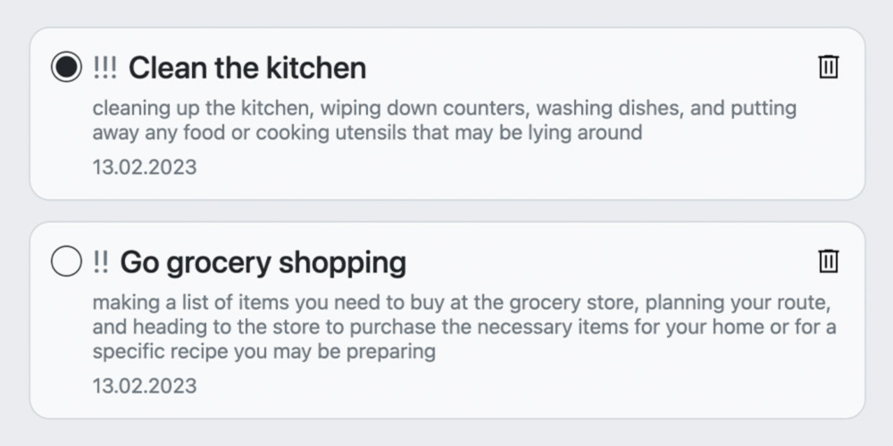

 

# My “Todo List” Project

## Description
In this project from “The Odin Project” I create a Todo List Web-Application  
This Todo App can:

- create new Todos in different projects,
- show all Todos,
- show Todos of today,
- show Todos of this week,
- show Todos of the current project.

All Todos and project are stored in the local storage.
On a page refresh nothing is lost.

## Links
- [Live Preview](https://tomsoerr.github.io/odin-todo-list/)
- Link to the [Assignment](https://www.theodinproject.com/lessons/node-path-javascript-todo-list)
- See my next [Project](https://github.com/TomSoerr/odin-weather-app)

## Notes
The icons are from google material icons and are licensed under the [Apache 2.0 license](https://www.apache.org/licenses/LICENSE-2.0.html).
If you have any copyright concerns please contact me and I will remove the content immediately.
