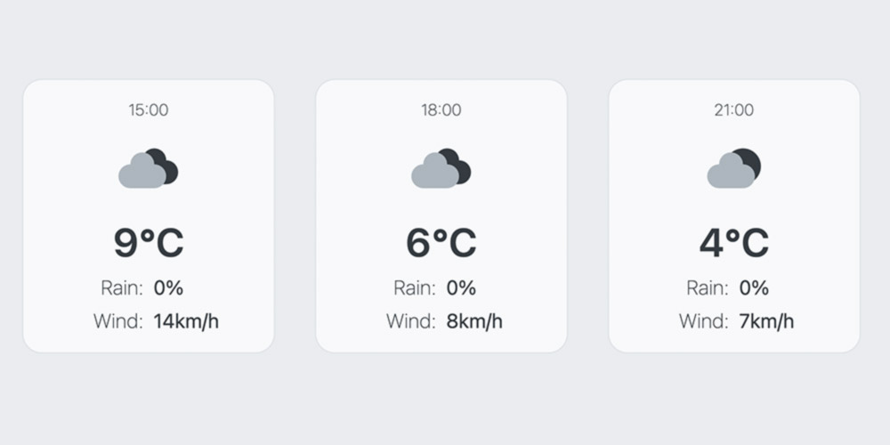

# My “Weather App” Project

## Description
In this project from “The Odin Project” I create a simple weather app with
the api from openweathermap.org 
This project has:

- a search bar that allows the user to search for a city,
- a fahrenheit/celsius toggle button,
- a current weather card and
- a forecast card.

The forecast is for one day.

## Links
- [Live Preview](https://tomsoerr.github.io/odin-weather-app/)
- Link to the [Assignment](https://www.theodinproject.com/lessons/node-path-javascript-weather-app)
- See my next [Project](https://github.com/TomSoerr/odin-testing-practice)

## Notes
I use the free Current Weather, 3-hour Forecast 5 days, and Geocoding APIs 
from openweathermap.org. 

If there are any legal issues please contact me.

The icons are by myself.

